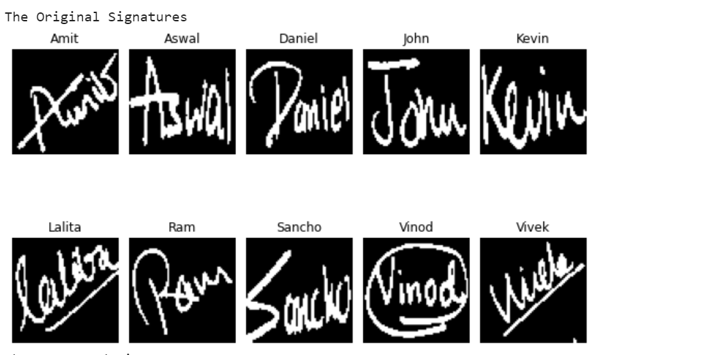
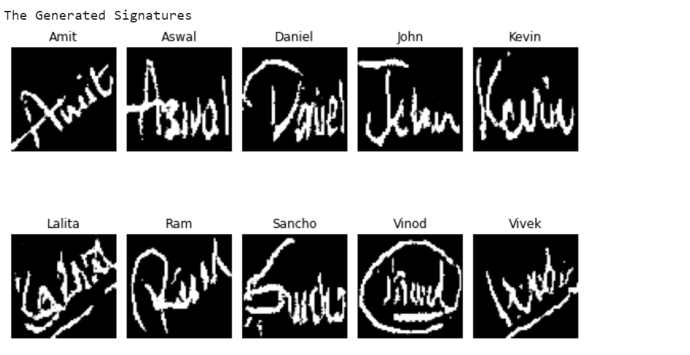
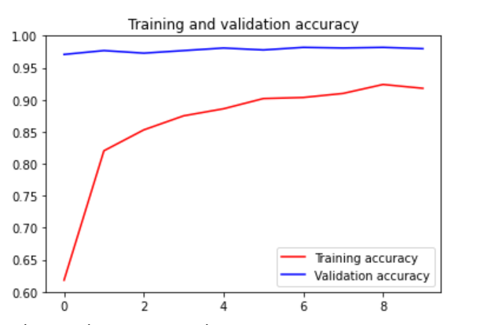

# Signature-Replication-using-Generative-Adversarial-Networks

This Project focuses on generating signatures along with their labels of 10 different people with the help of CGAN. With the help of a classifier, we can then classify those images as well as see their effects when used as training data for the classifier.

### Dataset
The Dataset consists of 10 different signature, each class having 100 instances.

### Code
The Code is available in the Jupyter notebook.

### Results
The generated and original images

The training history of Deep Convolutional Classifier trained on generated data and validated on original data

Confusion matrix of the validation data/test data

### Requirements
Tensorflow 1.15
